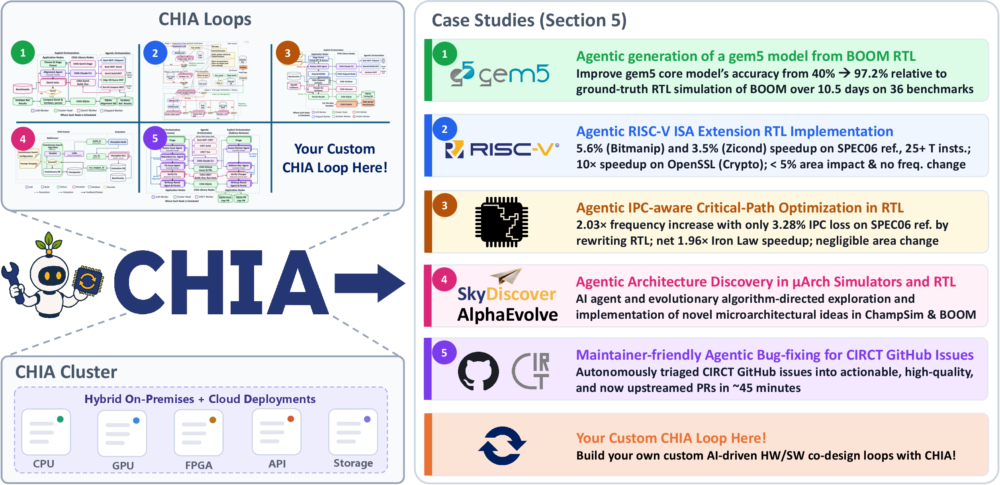
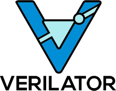

<p align="center">
  <picture>
    <source media="(prefers-color-scheme: dark)" srcset="docs/_static/chia-logo-inv.png">
    
  </picture>
</p>

<h3 align="center">CHIA: An open-source framework for principled, agentic AI-driven hardware/software co-design research</h3>

<p align="center">
  <a href="https://docs.chialoops.ai"><b>Documentation</b></a> &nbsp;•&nbsp;
  <a href="https://openreview.net/pdf?id=lLxEUReWHG"><b>Paper</b></a> &nbsp;•&nbsp;
  <a href="https://chialoops.ai"><b>Website</b></a>
</p>

---

## What is CHIA?

CHIA is an open-source framework for agile and principled hardware/software co-design research. Even though many of the steps of the  hardware/software co-design process can be accelerated by AI, existing research using AI in these contexts has been limited to small studies on isolated examples because it is still too hard to assemble more complex experiments. CHIA solves this problem by enabling  users to express the whole co-design **workflow** in an agile way with all of the tools you already use. CHIA abstracts workflows as graphs, and provides an efficient, feature rich runtime system to execute these workflows.

See the [documentation](https://docs.chialoops.ai/en/latest/getting-started/quickstart.html) to run your first flow!

## Installation

CHIA requires **Python 3.10.19** (matching the Python in the Docker images). With conda:

```bash
conda create -n chia_env python=3.10.19
conda activate chia_env
pip install -e /path/to/chia
```

## Learn more about CHIA

- **[CHIA Basics](https://docs.chialoops.ai/en/latest/getting-started/chia-basics.html)** — the core ideas, start here.
- **[Architecture Overview](https://docs.chialoops.ai/en/latest/concepts/overview.html)** — how CHIA works under the hood.

User guides:

- [ChiaFunction](https://docs.chialoops.ai/en/latest/user_guides/chia_function.html)
- [ChiaTool](https://docs.chialoops.ai/en/latest/user_guides/chia_tool.html)
- [Cluster Configuration Reference](https://docs.chialoops.ai/en/latest/user_guides/cluster_config_reference.html)
- [Building a CHIA-compatible Docker image](https://docs.chialoops.ai/en/latest/user_guides/docker_images.html)
- [Caching and Bypass](https://docs.chialoops.ai/en/latest/user_guides/caching_and_bypass.html)
- [Profiling](https://docs.chialoops.ai/en/latest/user_guides/profiling.html)

## Overview of CHIA and Early Case Studies

<p align="center">
  
</p>

## Integrations & Ecosystem

CHIA workflows compose the tools you already use across the hardware/software co-design stack:

<p align="center">
   &nbsp;&nbsp;
   &nbsp;&nbsp;
   &nbsp;&nbsp;
   &nbsp;&nbsp;
   &nbsp;&nbsp;
   &nbsp;&nbsp;
   &nbsp;&nbsp;
   &nbsp;&nbsp;
   &nbsp;&nbsp;
   &nbsp;&nbsp;
   &nbsp;&nbsp;
   &nbsp;&nbsp;
   &nbsp;&nbsp;
   &nbsp;&nbsp;
   &nbsp;&nbsp;
   &nbsp;&nbsp;
   &nbsp;&nbsp;
</p>

<p align="center">
  Powered by Ray:
</p>

<p align="center">
  
</p>

## Attribution

If you use CHIA in your research, please cite our paper:

```bibtex
@misc{cui2026chiaopensourceframeworkprincipled,
      title={CHIA: An open-source framework for principled, agentic AI-driven hardware/software co-design research}, 
      author={Angela Cui and Ferran Hermida-Rivera and Jack Toubes and Raghav Gupta and Jim Fang and Chengyi Lux Zhang and Ella Schwarz and Junha Kim and Yakun Sophia Shao and Borivoje Nikolic and Christopher W. Fletcher and Sagar Karandikar},
      year={2026},
      eprint={2606.27350},
      archivePrefix={arXiv},
      primaryClass={cs.AR},
      url={https://arxiv.org/abs/2606.27350}, 
}
```
